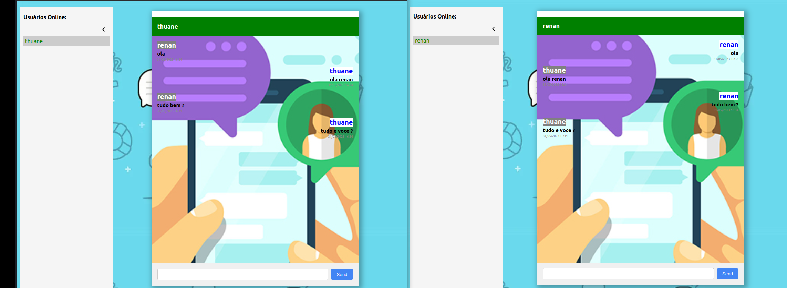

# Chat em Tempo Real

## Tecnologias

- ReactJS
- NodeJS
- JavaScript
- MongoDB
- Socket.io
- ExpressJS

## Descrição

Este é um projeto de um chat em tempo real, que consiste em um aplicativo web com funcionalidades de login, listagem de usuários online e troca de mensagens em tempo real entre os usuários conectados.

O projeto é dividido em um front-end desenvolvido em ReactJS e um back-end desenvolvido em NodeJS com o uso do framework ExpressJS. As mensagens são sincronizadas em tempo real através do Socket.io. O armazenamento dos dados de login é feito em um banco de dados MongoDB.

## Instruções de Instalação e Execução

### Pré-requisitos

- Node.js instalado (versão 12 ou superior)
- MongoDB instalado ou Docker instalado

### Back-End Depend ons MongoDB

1. Navegue até a pasta do back-end: `cd backend`
2. Instale as dependências: `npm install`
3. Inicie o servidor: `npm start:dev`
4. O servidor do back-end será executado na porta 4000.

### Front-End

1. Navegue até a pasta do front-end: `cd frontend`
2. Instale as dependências: `npm install`
3. Inicie a aplicação: `npm start`
4. A aplicação front-end será executada na porta 3000.

### Configuração do Banco de Dados

1. Certifique-se de que o MongoDB esteja em execução.
2. O arquivo de configuração do banco de dados está localizado em `backend/config/db.js`.
3. Verifique se as configurações do MongoDB (host, porta, nome do banco de dados) estão corretas.

Caso não tenha o MONGO instalado

1. Navegue até a pasta do back-end: `cd backend`
2. Buildar a imagem do mongo: `docker compose up --build`
3. Verifique se as configurações do MongoDB (host, porta, nome do banco de dados) estão corretas.

---

Agora você pode utilizar a aplicação de chat em tempo real! Faça o login, inicie conversas e aproveite a comunicação em tempo real com outros usuários.
